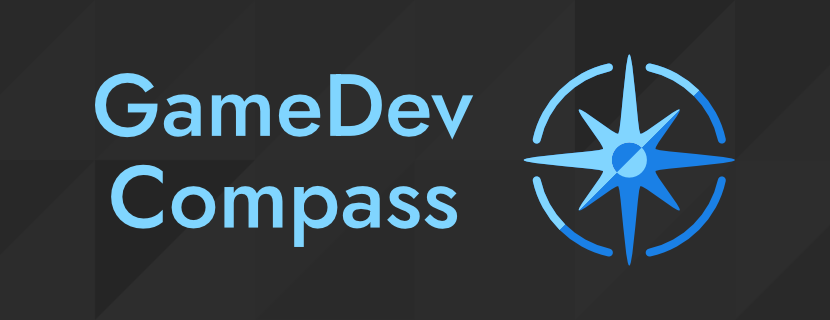

  

  Game development tutorials and resources for Godot Engine and beyond.

  
  
  

# 🧭 Welcome to GameDev Compass
This repository contains accompanying source code and other files for [GameDev
Compass video tutorials](https://www.youtube.com/@GameDevCompass/videos). Found
a bug or have an idea? Feel free to [submit an isssue](https://github.com/Reun-Media/gamedev-compass/issues)
or [open a pull request](https://github.com/Reun-Media/gamedev-compass/pulls).

## Support us
Currently the best way to support us is to [watch, like and share our videos](https://www.youtube.com/@GameDevCompass/videos).  
You can also [subscribe](https://www.youtube.com/@GameDevCompass?sub_confirmation=1) to GameDev Compass on YouTube and follow @GameDevCompass on [Mastodon](https://mastodon.gamedev.place/@GameDevCompass) and [X / Twitter](https://twitter.com/GameDevCompass).
